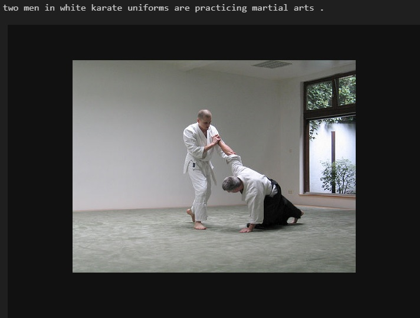
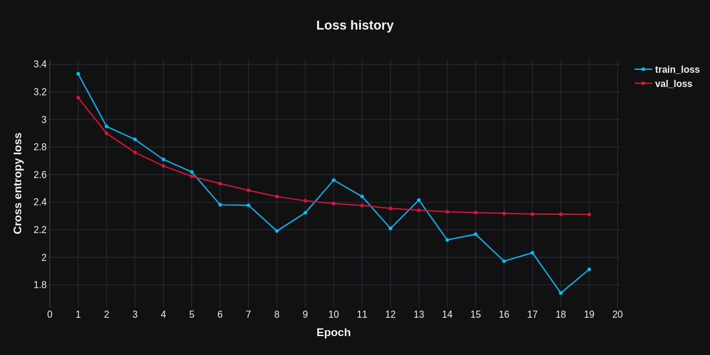
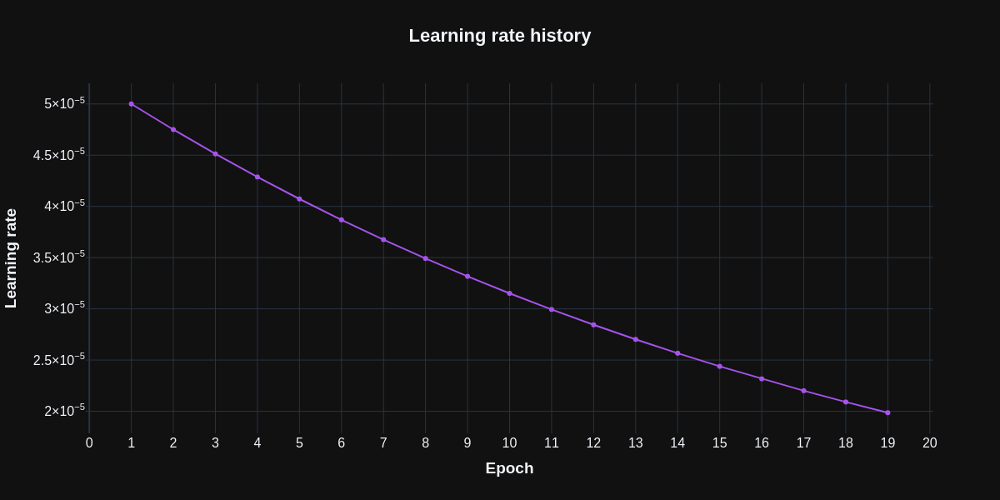

# <center>Image captioning</center>
<details>
  <summary><b>Example</b> (clickable spoiler)</summary>

  
  
  
</details>

## Overview
**Architecture of the model:**  


Model is trained on [<b>Flickr30k</b>](https://www.kaggle.com/datasets/hsankesara/flickr-image-dataset) dataset.

* As an **encoder** used [<b>ResNet-152</b>](https://pytorch.org/vision/main/models/generated/torchvision.models.resnet152.html) pretrained model.

* As a **decoder** used [<b>Transformer</b>](https://pytorch.org/docs/stable/generated/torch.nn.Transformer.html#torch.nn.Transformer) module.

Model have `53.1 M` trainable parameters and `58.1 M` non-trainable parameters with total number of parameters `111.2 M`. You can change number of trainable parameters by changing `d_model` argument.

`d_model` is the embedding size for the text, feature map size for the image and hidden size of the *Transformer*.

It took 19 epochs of training in order to achieve cross-entropy loss on a validation sample equal to `2.31` with following hyperparameters:
```yaml
d_model: 512
dropout_rate: 0.1
gamma: 0.95
lr_start: 5.0e-05
num_heads: 8
vocab_size: 7736
```
  


You can achieve better results by changing hyperparameters, especially `d_model` and `num_heads`, but it will take more time to train.

You can also look at [<b>extra_research</b>](extra_research) to see the result of the model with `d_model=128` and `num_heads=4` with same training hyperparameters.

## How to use
1. <b><i>Python 3.11.x</i></b> with installed [<b>requirements</b>](requirements.txt): `pip install -r requirements.txt`

2. To train model on your own dataset follow this notebook: [<b>training.ipynb</b>](training.ipynb)

3. To use pretrained model on any single image from path or *URL* follow this notebook: [<b>inference.ipynb</b>](inference.ipynb)

## Reference
[<b><i>Flickr30k</i> dataset</b>](https://www.kaggle.com/datasets/hsankesara/flickr-image-dataset)

[<b>Attention is All You Need</b>](https://arxiv.org/abs/1706.03762)

[<b>A detailed guide to <i>PyTorch</i>’s `nn.Transformer()` module</b>](https://towardsdatascience.com/a-detailed-guide-to-pytorchs-nn-transformer-module-c80afbc9ffb1)